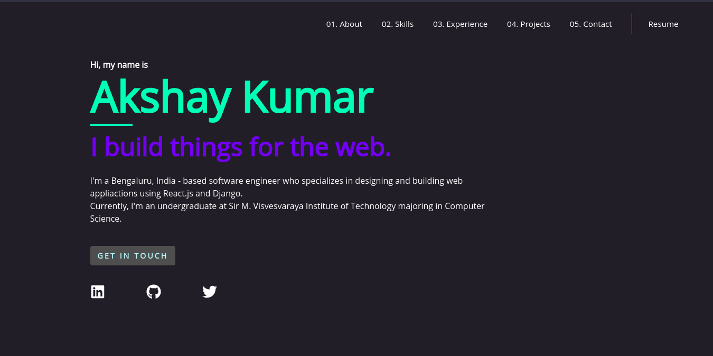

<div align="center">
  
</div>
<h1 align="center">
  Akshay Kumar Portfolio - v1
</h1>
<p align="center">
  This is the 1st iteration of <a href="" target="_blank">akshay-kumar-007.com</a> built with <a href="https://www.gatsbyjs.org/" target="_blank">Gatsby</a> & <a href="https://strapi.io/" target="_blank"> Strapi </a>and hosted with <a href="https://www.netlify.com/" target="_blank">Netlify</a>
</p>



## 🛠 Installation & Set Up

1. Install the Gatsby CLI

   ```sh
   npm install -g gatsby-cli
   ```

2. Install and use the correct version of Node using [NVM](https://github.com/nvm-sh/nvm)

   ```sh
   nvm install
   ```

3. Install dependencies

   ```sh
   npm install
   ```

4. In order to use complete project you will need:

- Strapi Instance with all Contet-Types and at least single instance of data (for each content-type). Check gatsby-config and graphQL queries in components.
- Allow Permissions for all content-type(s)
- If you add/modify new content-types, Make sure such content-types exist in your Strapi application. Or replace/delete them in gatsby-config.js

```javascript
{
      resolve: `gatsby-source-strapi`,
      options: {
        apiURL: `http://localhost:1337`,
        queryLimit: 1000, // Default to 100
        // contentTypes: [`jobs`, `projects`, `blogs`, ],
        //singleTypes:[`about` ]
        contentTypes: [`jobs`, `projects`, `skills`],
        singleTypes: [`about`],
      },
    },
```

1. Start the gatsby development server using command

   ```sh
   npm run develop
   ```

## 🚀 Building and Running for Production

1. Generate a full static production build

   ```sh
   npm run build
   ```

1. Preview the site as it will appear once deployed

   ```sh
   npm run serve
   ```
